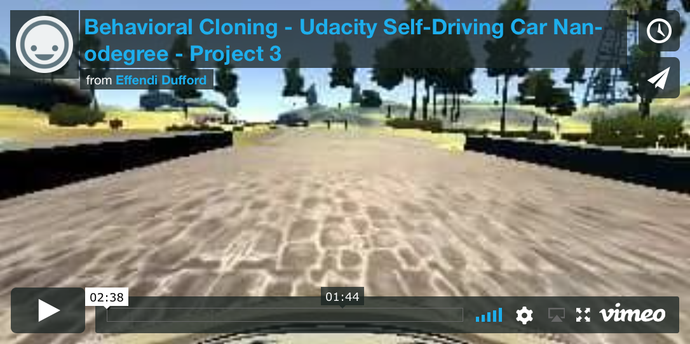
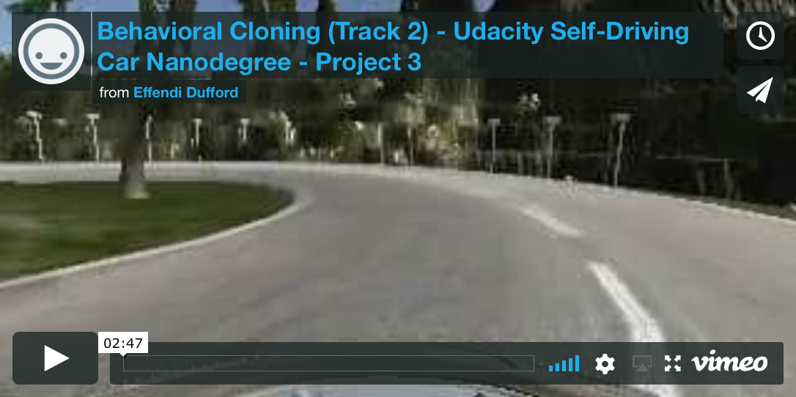

# **Behavioral Cloning**

**Udacity Self Driving Car Nanodegree - Project #3**

2017/7/25

## Overview

This project uses **Keras** to train a convolutional neural network to do **end-to-end steering angle control based on road images** from a Udacity driving simulator.  Training data from driving around one track was used to generate a **saved model file that can be used to drive the car autonomously** on both provided tracks.  This demonstrates the neural network's ability to generalize road feature detection and control steering by **cloning real driving behavior**, similar to the results from the NVIDIA Apr 25, 2016 paper "[End to End Learning for Self-Driving Cars](https://arxiv.org/pdf/1604.07316v1.pdf)."

Driving on Track 1 after learning:

[](https://vimeo.com/244402173)

Driving on optional Track 2 using only learning from Track 1:

[](https://vimeo.com/244402254)

For more details about the results of this activity, see the [project writeup document](writeup_P3.md).

## Key Files

| File 					|     Description	        								|
|:---------------------:|:---------------------------------------------------------:|
| load_data.py 			| Python code to gather data sets for model.py to use	 	|
| model.py 				| Python code to train and save Keras model as model.h5		|
| drive.py 				| Python code to use model.h5 to drive Udacity simulator	|
| model.h5				| Saved Keras trained model file							|
| [writeup_P3.md](writeup_P3.md)			| The project writeup explaining the results				|
| video.mp4				| Video capture of simulator autonomously driving Track #1	|

The original Udacity project repository is [here](https://github.com/udacity/CarND-Behavioral-Cloning-P3).

## How to Run Code to Drive Simulator Autonomously

1. Set up [Udacity Self-Driving Car Term 1 Starter Kit](https://github.com/udacity/CarND-Term1-Starter-Kit) environment (Python 3, NumPy, Matplotlib, OpenCV, TensorFlow)

2. Run the [Udacity Simulator](https://github.com/udacity/self-driving-car-sim) in **"Fastest" graphics quality mode** and select a track to drive autonomously.

3. Run the following to start the autonomous driving commands:

```
python drive.py model.h5
```