# **Behavioral Cloning**

**Udacity Self Driving Car Nanodegree - Project #3**

Effendi Dufford
2017/7/25

## Project Goal

The goals / steps of this project are the following:

* Use the simulator to collect data of good driving behavior
* Build, a convolution neural network in Keras that predicts steering angles from images
* Train and validate the model with a training and validation set
* Test that the model successfully drives around Track #1 without leaving the road
* Summarize the results with a written report

## Results by Rubric Criteria

### Files Submitted & Code Quality

#### 1. Submission includes all required files and can be used to run the simulator in autonomous mode

My project files are located in this [github repository](https://github.com/edufford/CarND-Behavioral-Cloning-P3).
The key contents are:

| File 					|     Description	        								| 
|:---------------------:|:---------------------------------------------------------:| 
| load_data.py 			| Python code to gather data sets for model.py to use	 	| 
| model.py 				| Python code to train and save Keras model as model.h5		| 
| drive.py 				| Python code to use model.h5 to drive Udacity simulator	|
| model.h5				| Saved Keras trained model file							|
| writeup_P3.md			| This project writeup										|
| video.mp4				| Video capture of simulator autonomously driving Track #1	|

#### 2. Submission includes functional code

My model was trained using image data collected by the Udacity simulator **running in "Fastest" graphics quality mode**, due to the low processing speed of my laptop.  This mode does not have some visual effects such as shadows from the other graphics modes, so the model needs to be executed in the same mode to be able to drive autonomously as trained.

The car can be driven autonomously around the track by setting the Udacity simulator to **"Fastest" graphics quality mode** and executing:

```
python drive.py model.h5
```

My **drive.py** file has one modification to apply a min/max guard on the PI controller's integral term, in order to prevent excessive error wind-up during tire slipping from the slopes on Track #2.

#### 3. Submission code is usable and readable

I separated the code for gathering the training/validation data sets in **load_data.py** from the code for training and saving the convolution neural network in **model.py**.

The **load_data.py** code saves arrays **X_train.npy, y_train.npy** and **X_valid.npy, y_valid.npy** that contain the file paths for all of the driving images and their corresponding steering angles, including and tuned adjustments for left/right camera and lane-edge recovery driving.

The **model.py** code loads these data set arrays and uses a Python generator to load batches of the image data into memory on demand as the Keras model fit training is executed.  After 10 epochs of training is done, the model file **model.h5** and training history are saved.

See the code comments for more details.

### Model Architecture and Training Strategy

#### 1. An appropriate model architecture has been employed

For this project, I wanted to focus on how to generate good quality training data for the neural network to be able to clone driving behavior, so I did not focus much on optimizing the model architecture.

I used Keras to make a sequential model with similar layers to the NVIDIA model in the Apr 25, 2016 paper "[End to End Learning for Self-Driving Cars](https://arxiv.org/pdf/1604.07316v1.pdf)", because this model has already been shown to be able to control steering angles while adapting to various driving environments.  The input image size of the NVIDIA model was 66 x 200, and the Udacity simulator's generated image size is 160 x 320 so with some cropping it should be similar enough to use this model's architecture.


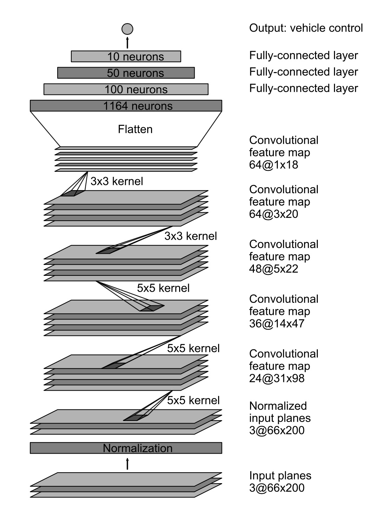
*Source: NVIDIA paper "End to End Learning for Self-Driving Cars"*

#### 2. Attempts to reduce overfitting in the model

In order to reduce overfitting, Keras makes it easy to add dropout layers that are used during training but not during validation/prediction.  I added 50% dropout layers after the 100 neuron and 50 neuron fully connected layers.  I did not add dropout on the last 10 neuron layer since the number of connections is already so small.  During training, the training loss and validation loss converged smoothly to their minimums without overfitting.

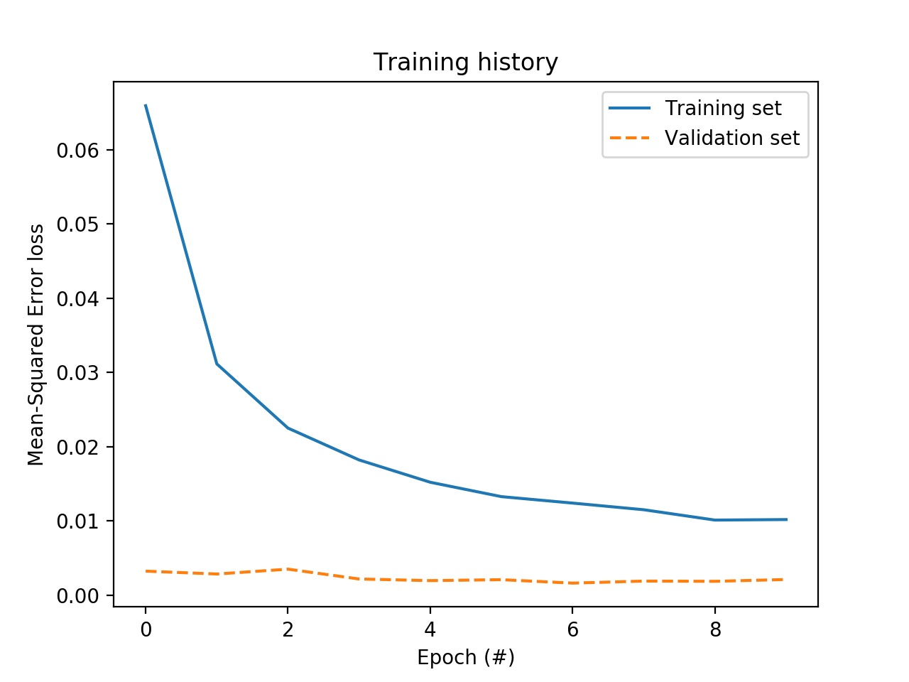

*Note: The training set includes tuning-adjusted steering angles from left/right cameras and lane-edge recovery, but the validation set only includes the center camera of normal driving, so the mean squared error is lower for the validation set.*

#### 3. Model parameter tuning

The Adam optimizer was used on the mean squared error with the default learning rate parameters and this was able to smoothly stabilize the losses after 10 epochs, so no additional hyperparameter tuning was needed.

#### 4. Appropriate training data

My goal was to only take training data from Track #1 and see if the learned model could be generalized enough to also be able to drive Track #2 as an extra challenge.

My strategy for collecting Track #1 training data was to get 5 types of driving:

* Data #1 = Driving in the center of the road in the normal counter-clockwise direction
* Data #2 = Driving on the left edge of the road in the normal direction
* Data #3 = Driving on the right edge of the road in the normal direction
* Data #4 = Driving in the center of the road in the backwards clockwise direction
* Data #5 = Driving naturally around the track a few times to get some variation

For all data, 70% of the straight driving data (steering < 0.04) was discarded to prevent a strong bias toward driving straight.

Data #1 center camera images were split into **80% training data** and **20% validation data** as a baseline data set.

Data #1 left/right camera images were used with an **added steering adjustment of 0.3** to give the model some **lane centering feedback**.

Data #2 and #3 center camera images were used with an **added steering recovery adjustment of 0.9** to give the model some **sharp turning capability** to prevent going off the track, especially important for the hairpins on Track #2.

Data #4 and #5 center camera images were used as **extra data to help increase variation and improve generalization**.

After gethering all of the training data described above, the final distribution of steering angles is shown below.

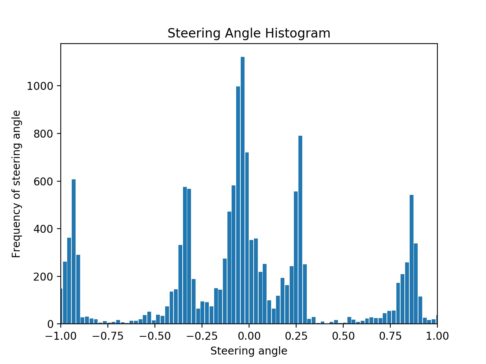

The data has a slight left turn bias (from the counter-clockwise track direction), but data augmentation will be used to do horizontal flipping of all images and steering angles so it becomes symmetric during training.

### Architecture and Training Documentation

#### 1. Solution Design Approach

As discussed above, my approach for choosing the model architecture was to try using the published NVIDIA architecture since the input image sizes are similar and the purpose of the model is the same.

Further optimization could be done by experiments to remove layers or reduce feature dimensions to see if the driving performance can be maintained, but the original architecture already has fast enough prediction performance to be able to drive the Udacity simulator on my laptop so this was not necessary to complete this project.

Also, training time was reasonable using the AWS EC2 g2.2xlarge cloud-based GPU machine, with 10 epochs taking only ~15 min with ~30,000 training images.

#### 2. Final Model Architecture

The final model characteristics are shown in the table below compared to the original NVIDIA model.

| Layer					| NVIDIA Model		| Final Model		|
|:---------------------:|:-----------------:|:-----------------:| 
| Input 				| 3 @ 66 x 200		| 3 @ 160 x 320		|
| Crop 					| -					| 3 @ 90 x 320		|
| Normalization 		| 3 @ 66 x 200		| 3 @ 90 x 320		|
| CNN 5x5, stride 2x2	| 24 @ 31 x 98		| 24 @ 43 x 158		|
| CNN 5x5, stride 2x2	| 36 @ 14 x 47		| 36 @ 20 x 77		|
| CNN 5x5, stride 2x2	| 48 @ 5 x 22		| 48 @ 8 x 37		|
| CNN 3x3, stride 1x1	| 64 @ 3 x 20		| 64 @ 6 x 35		|
| CNN 3x3, stride 1x1	| 64 @ 1 x 18		| 64 @ 4 x 33		|
| Flatten				| 1164 neurons		| 8448 neurons		|
| FCL					| 100 neurons		| 100 neurons		|
| Dropout				| -					| 50% dropout		|
| FCL					| 50 neurons		| 50 neurons		|
| Dropout				| -					| 50% dropout		|
| FCL					| 10 neurons		| 10 neurons		|
| Output				| steering angle	| steering angle	|
| Trainable Parameters	| ~250,000			| 981,819			|

The cropping layer cuts off the top 50 and bottom 20 pixel rows to focus on the road portion of the image, following the "Cropping Layer Code Example" from the Udacity lesson.

After the cropping, the input image dimensions are still larger than the NVIDIA model so there are about 4x more trainable parameters, but the added dropout layers help prevent overfitting and the model is still capable of the end-to-end road feature detection and steering angle prediction to control the vehicle as it drives.

#### 3. Creation of the Training Set & Training Process

As described above, the final training data set includes 5 types of driving.  Example images from each type of data are shown below.

---

**Data #1 = Driving in the center of the road in the normal counter-clockwise direction**

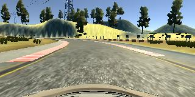
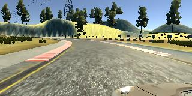 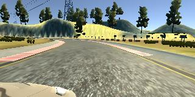

From this data, the center camera image (top image) was used as **baseline data** and split 80% for training and 20% for validation.

The left camera (bottom left image) and right camera (bottom right image) from this data was used to make the model steer back toward the center of the lane by **adding 0.3 steering adjustment** to the base steering angle.

---

**Data #2 = Driving on the left edge of the road in the normal direction**

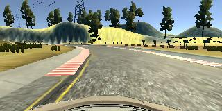

This data was taken driving normally but keeping the **left wheels of the car on the left edge of the road**.  The center camera image was used with an **added 0.9 steering recovery adjustment** to the base steering angle to make the car recover from the lane edges by steering more sharply back toward the center of the lane.

---

**Data #3 = Driving on the right edge of the road in the normal direction**

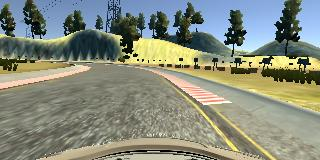

This data is similar to Data #2, except keeping the **right wheels of the car on the right edge of the road**.

---

**Data #4 = Driving in the center of the road in the backwards clockwise direction**

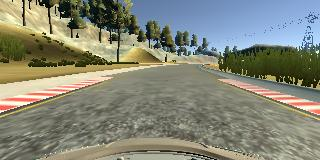

This data is similar to Data #1 normal driving, but in the **backwards clockwise direction** to help reduce the left turning bias of the track.

---

**Data #5 = Driving naturally around the track a few times to get some variation**

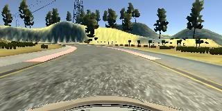 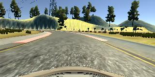
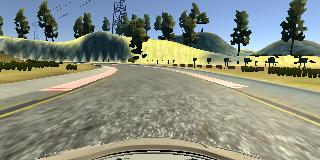 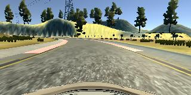

This data is similar to Data #1 normal driving, but **driving naturally for extra laps** to increase variation and improve generalization.

---

### Simulation

#### 1. Car's ability to navigate the test track

Using the **drive.py** file and the **model.h5** trained model file, the car is able to autonomously drive around Track #1, as shown in the **video.mp4** recorded video.  The steering is not completely natural, and could benefit from some post-processing smoothing to reduce any twitchy steering changes, but overall follows the road and keeps the car in the center of the lane.

Even though the model was trained with only Track #1 data sets, the model was generalized enough to **also be able to drive around the extra challenge Track #2** which has lane lines that look completely different and track features such as slopes and sharp hairpin turns.  This is shown in the **extra_video_track2.mp4** recorded video.

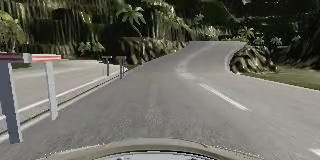 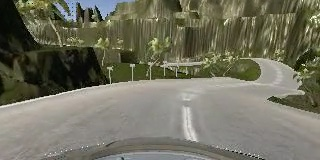

It's pretty interesting to see how an end-to-end convolutional neural network can clone driving behavior with very little manual tuning or design work.  The key is that **good learning results come from gathering good quality training data** and preparing it in a way that encourages the model to learn the desired behaviors.